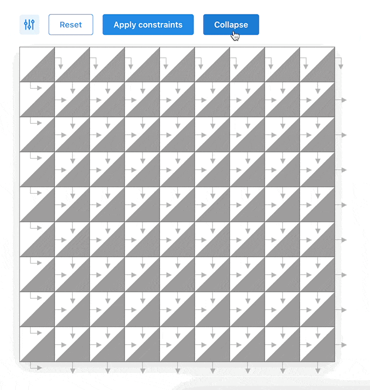

# Crossword grid generator

[Live demo](https://crossword-generator.netlify.app/)

Implementation of the wave function collapse algorithm to generate a crossword puzzle grid according to customizable constraints.